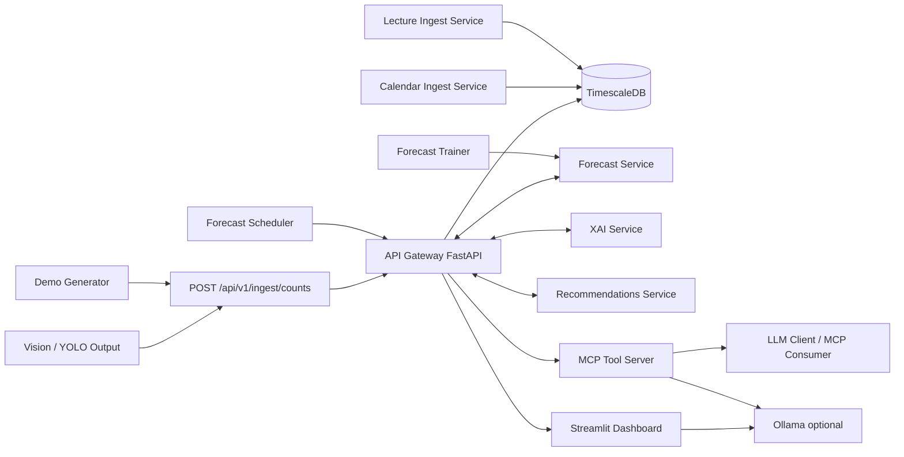

# Sitcheck

Sitcheck is an end-to-end occupancy intelligence stack:

- Vision/YOLO output ingestion
- Timeseries storage on TimescaleDB
- Forecast service (baseline + optional model flags)
- XAI service (drivers + uncertainty + evidence)
- Recommendation and counterfactual simulation service
- API gateway
- Streamlit dashboard (Ops + Executive + Assistant)
- MCP tool server (read-only MVP)

The implementation is schema-first and guardrail-first:

- Shared JSON Schemas are the source of truth (`packages/shared/schemas`)
- MCP and Assistant use fixed tools only (no free SQL, no DB direct access)
- Every service exposes `/health`

## Architecture



## Repository Layout

```text
apps/
  api-gateway/        # Public REST API + DB access + orchestration
  dashboard/          # Streamlit Ops/Executive/Assistant UI
  mcp-sitcheck/       # Node MCP server (read-only tools)
services/
  forecast/           # Forecast model API
  forecast-scheduler/ # Periodic forecast snapshot scheduler (API-only)
  forecast-trainer/   # Nightly scientific evaluate + lecture ablation runner
  xai/                # Explanation API
  recommendations/    # Rule engine + scenario simulation API
  calendar-ingest/    # Optional ICS -> calendar_events ingestion API
  lecture-ingest/     # DHBW lecture feeds -> lecture_activity ingestion API
packages/
  shared/schemas/     # Canonical JSON Schemas (SoT)
infra/
  db/migrations/      # SQL migration bootstrap for Timescale
scripts/
  demo/               # Synthetic count generator
  tests/              # Contract and smoke tests
docs/
  deploy-remote.md    # Ubuntu remote deployment guide
  scientific-training.md # Scientific training and promotion methodology
```

## Data Model

Core tables (see `infra/db/migrations/001_init.sql`):

- `zones`
- `counts` (hypertable on `ts`)
- `calendar_events`
- `lecture_activity`
- `forecasts`
- `explanations`
- `recommendations`
- `scenario_runs`

Continuous aggregates:

- `counts_1m`
- `counts_5m`

## Public API

- `GET /health`
- `GET /api/v1/zones`
- `GET /api/v1/counts?zone_id&from&to&granularity`
- `POST /api/v1/ingest/counts`
- `GET /api/v1/lectures/activity?zone_id&from&to&granularity`
- `GET /api/v1/forecast?zone_id&horizon`
- `GET /api/v1/forecast/latest?zone_id&horizon&stale_seconds`
- `GET /api/v1/forecast/history?zone_id&horizon&from&to&limit`
- `GET /api/v1/dashboard/command-center?zone_id&horizon&history_minutes&stale_seconds&long_term_days`
- `GET /api/v1/explain?zone_id&horizon`
- `GET /api/v1/recommendations?zone_id&horizon`
- `POST /api/v1/scenarios/simulate`
- `GET /api/v1/calendar/events?zone_id&from&to`

Internal (scheduler only):

- `POST /api/v1/internal/forecast/snapshot` (requires `X-Internal-Token`)

Forecast service internal endpoints (optional):

- `POST /v1/train` (zone model training for `tf_mlp`)
- `POST /v1/train/batch` (multi-horizon training + promotion gate)
- `POST /v1/train/evaluate` (rolling-origin scientific evaluation report, no auto-promotion)
- `POST /v1/train/promote` (promote exactly one scientifically validated run)
- `GET /v1/model/status?zone_id&horizon`
- `GET /v1/model/report/latest?zone_id&horizon`

Forecast trainer internal endpoints (optional):

- `GET /health`
- `GET /status`
- `POST /run-once` (manual trigger for one full nightly evaluate/ablation cycle)

### Minimal ingest example

```bash
curl -X POST http://localhost:8000/api/v1/ingest/counts \
  -H "content-type: application/json" \
  -d '{
    "points": [{
      "timestamp": "2026-02-18T18:00:00Z",
      "zone_id": "default-zone",
      "occupancy": 42,
      "source": "vision-counter",
      "quality_score": 0.92,
      "quality_flags": ["OK"],
      "evidence": {
        "evidence_id": "ev-1",
        "generated_at": "2026-02-18T18:00:00Z",
        "time_window": {"from": "2026-02-18T17:30:00Z", "to": "2026-02-18T18:00:00Z"},
        "sources": [{"type": "counts", "id": "frame-window-1"}],
        "model": {"name": "yolo", "version": "v8"},
        "quality": {"score": 0.92, "flags": ["OK"]}
      }
    }]
  }'
```

### Scientific Training Flow (no Docker required)

Runtime default ist `tf_mlp`, aber Training ist standardmaessig gesperrt (`FORECAST_TRAINING_MODE=locked`).
Scientific Evaluate + Promotion laufen nur im expliziten Wartungsmodus (`maintenance`).

Evaluate a run with rolling-origin backtesting (`train/val/test + gap`) and baseline benchmark:

```bash
curl -X POST "http://localhost:8001/v1/train/evaluate" \
  -H "content-type: application/json" \
  -d '{
    "zone_id": "default-zone",
    "horizons": [60, 1440, 10080],
    "folds": 6,
    "train_days": 30,
    "val_days": 7,
    "test_days": 7,
    "gap_minutes": 60,
    "primary_horizon": 60,
    "segment_min_samples": 30,
    "include_lecture_impact": true,
    "save_report": true
  }'
```

Promote exactly one evaluated run (only if `decision.scientific_pass=true` and champion is `tf_mlp`):

```bash
curl -X POST "http://localhost:8001/v1/train/promote" \
  -H "content-type: application/json" \
  -d '{
    "zone_id": "default-zone",
    "run_id": "eval-20260226...."
  }'
```

Read latest scientific report:

```bash
curl "http://localhost:8001/v1/model/report/latest?zone_id=default-zone&horizon=60"
```

Nightly evaluate + ablation manuell anstoßen (Trainer-Service auf `:8013`):

```bash
./scripts/train/run_nightly_eval_once.sh
```

Neueste validierte Evaluation manuell promoten:

```bash
./scripts/train/promote_latest_validated.sh
```

Bewusster Backend-Wechsel fuer Forecast-Startpfad (`tf_mlp` oder `baseline`):

```bash
./scripts/train/switch_backend_tf.sh tf_mlp
```

Einmaligen H60-Retrain mit Scientific Gate (inkl. Re-Lock) ausfuehren:

```bash
./scripts/train/retrain_once_h60_and_lock.sh
```

## MCP Tools (read-only)

Implemented tools:

- `get_live_occupancy`
- `get_history`
- `get_forecast`
- `explain_forecast`
- `list_calendar_events`
- `recommend_actions`
- `simulate_scenario` (always forces `persist=false`)
- `generate_executive_brief` (optional Ollama narrative)

Guardrails:

- No direct DB access from MCP
- No free-form SQL
- AJV validates tool input and output schemas
- API-only integration

## Usable XAI Patterns Implemented

Current MVP patterns:

1. Progressive disclosure
   - One-line summary
   - Top drivers
   - Evidence/citations object
   - Counterfactual simulation endpoint
2. Evidence-first explanations
   - Every explanation/recommendation carries evidence IDs, time window, sources, model, quality
3. Uncertainty-aware actions
   - Recommendation gates block actions on poor quality/high uncertainty

Roadmap / backlog (from Moonlight review inspiration):

- Highlight overlays in UI
- Deeper citation drilldown and source ranking
- Deeper retrieval for long-range context

## Dashboard

`apps/dashboard` now uses a Command Center layout:

- `Command Center`: one-screen ops + executive overview
  - service health + alert rail (`STALE`, `BASELINE_FALLBACK`, `QUALITY_RISK`, `UNCERTAINTY_HIGH`, `NO_DATA`)
  - KPI strip (live occupancy/utilization, snapshot age, model version, peak, uncertainty)
  - history + forecast corridor chart
  - top drivers, recommendations, evidence/citations, scenario simulation, horizon snapshots, calendar context
- `Forecast Lab`: long-horizon deep-dive + snapshot history
- `Assistant`: agentic workflow inspired by the Medium blueprint
  - Query Agent
  - Plot Agent
  - Analysis Agent
  - RAG Agent

Assistant tools are strictly fixed REST tool calls.

### Command Center Aggregate Endpoint

The dashboard primarily reads a single aggregate payload:

- `GET /api/v1/dashboard/command-center`

This endpoint aggregates:

- live counts state + compact history
- latest forecast snapshot
- long-term snapshot set (`60`, `1440`, `10080`, `20160`, and requested long-term horizon)
- explanation + recommendations
- calendar events
- service health checks
- alert rail state

### LLM Explainability (ECP v2)

Explainability V2 centralizes prompting + LLM input in the API-Gateway. Dashboard and MCP call API endpoints instead of building prompts locally.

New endpoints:

- `GET /api/v1/explain/context?zone_id=...&horizon=...&audience=...&language=...`
- `POST /api/v1/explain/narrative`
- `POST /api/v1/explain/prompt/preview` (debug only, gated by env)

Context includes:

- `request_meta`
- `zone_capacity`
- `utilization_now_pct`
- `occupancy_explainer`
- `improvement_candidates`
- `forecast_snapshot`
- `history_digest` (including similar-pattern summary)
- `driver_summary`
- `uncertainty`
- `recommendation_digest`
- `lecture_impact_digest`
- `quality_digest`
- `citation_map`
- `policy_block`

Schemas:

- `packages/shared/schemas/llm-explainability-context-v2.schema.json`
- `packages/shared/schemas/llm-explanation-response.schema.json`
- legacy compatibility stays available:
  - `packages/shared/schemas/llm-explainability-context.schema.json`

Prompt templates are versioned in:

- `packages/shared/prompts/explainability/manifest.json`
- `packages/shared/prompts/explainability/*.md`

Template profiles (DE default):

- `ops`
- `executive`
- `enduser`
- `professor`

Dual output contract:

1. Narrative fields (`one_liner`, `warum`, `unsicherheit`, `empfehlung`, `evidence_hinweis`)
2. Structured JSON block with evidence refs for each claim

## Configuration

Copy:

```bash
cp .env.example .env
```

Important toggles:

- `OLLAMA_ENABLED=false` (default)
- `EXPLAINABILITY_PROFESSOR_MODE_ENABLED=true`
- `INTERNAL_API_TOKEN=change_me_internal`
- `FORECAST_MODEL_BACKEND=tf_mlp`
- `FORECAST_TRAINING_MODE=locked`
- `FORECAST_SNAPSHOT_INTERVAL_SECONDS=300`
- `FORECAST_SNAPSHOT_HORIZONS=60,10080,20160` (1h, 1 Woche, 2 Wochen)
- `FORECAST_SNAPSHOT_ZONES=auto`
- `FORECAST_SNAPSHOT_RETENTION_DAYS=14`
- `FORECAST_STALE_THRESHOLD_SECONDS=900`
- `DASHBOARD_AUTO_REFRESH_SECONDS=15`
- `MAX_FORECAST_HORIZON_MINUTES=43200` (bis 30 Tage)
- `LONG_HORIZON_STEP_MINUTES=60` (lange Horizonte stündlich)
- `XAI_SHAP_ENABLED=false`
- `TF_MODEL_DIR=/models`
- `TF_MIN_TRAIN_POINTS=2000`
- `TF_DEFAULT_HORIZON=60`
- `TF_USE_CALENDAR_FEATURES=true`
- `TF_ENABLE_GPU=false`
- `TF_TRAIN_EPOCHS=120`
- `TF_BATCH_SIZE=64`
- `TF_TRAIN_HISTORY_HOURS=720`
- `TF_INFERENCE_HISTORY_HOURS=72`
- `TF_TRAIN_HORIZONS=60,1440,10080,20160`
- `TF_PROMOTION_MIN_IMPROVEMENT=0.0`
- `FORECAST_CONTEXT_MIN_POINTS=120`
- `FORECAST_CONTEXT_STALE_SECONDS=900`
- `FORECAST_CONTEXT_MAX_HISTORY_HOURS=720`
- `CALENDAR_ICS_URLS=` (optional, comma-separated ICS URLs)
- `LECTURE_SITE_CODE=MA`
- `LECTURE_API_BASE_URL=https://api.dhbw.app`
- `LECTURE_REFRESH_INTERVAL_SECONDS=1800`
- `LECTURE_BACKFILL_ENABLED=true`
- `FORECAST_TRAINER_ENABLED=false` (Nightly-Training standardmaessig aus)

### Optional ICS Import

- Start importer profile:
  - `docker compose --profile calendar up -d`
- Example local demo ICS source:
  - `CALENDAR_ICS_URLS=file:///project_sitcheck/scripts/demo/sample_calendar.ics`
- Imported entries are materialized in `calendar_events` and surfaced via:
  - `GET /api/v1/calendar/events`

### Lecture Density Import

- `lecture-ingest` runs in core compose and writes `lecture_activity`.
- Source strategy:
  - backfill: `https://api.dhbw.app/ics/{course}` for MA courses
  - refresh: `https://api.dhbw.app/rapla/MA/lectures`
- Validation endpoint:
  - `GET /api/v1/lectures/activity`

## Quickstart

Core stack:

```bash
docker compose up -d
```

This starts `forecast-scheduler` by default for constant forecast snapshots.

Include demo data generator:

```bash
docker compose --profile dev up -d
```

Include optional calendar importer:

```bash
docker compose --profile calendar up -d
```

Run dev + calendar together:

```bash
docker compose --profile dev --profile calendar up -d
```

Include optional periodic TF trainer job:

```bash
docker compose --profile ml-train up -d
```

Run dev + calendar + ml-train together:

```bash
docker compose --profile dev --profile calendar --profile ml-train up -d
```

Include Ollama container:

```bash
docker compose --profile ollama up -d
```

### Constant Forecast Mode

`forecast-scheduler` runs by default and pre-computes snapshots into `forecasts`.
For long-term planning it can pre-compute weekly horizons (`10080`, `20160` minutes).

Check latest snapshot:

```bash
curl "http://localhost:8000/api/v1/forecast/latest?zone_id=default-zone&horizon=60"
```

Inspect snapshot history:

```bash
curl "http://localhost:8000/api/v1/forecast/history?zone_id=default-zone&horizon=60&from=2026-02-24T00:00:00Z&to=2026-02-24T23:59:59Z&limit=50"
```

Core checks:

```bash
curl http://localhost:8000/health
curl "http://localhost:8000/api/v1/zones"
curl "http://localhost:8000/api/v1/lectures/activity?zone_id=default-zone&from=2026-02-24T00:00:00Z&to=2026-02-24T23:59:59Z&granularity=15m"
curl "http://localhost:8000/api/v1/forecast?zone_id=default-zone&horizon=60"
```

## Local Verification Commands

```bash
.venv/bin/python3 scripts/tests/schema_contract_test.py
node scripts/tests/schema_contract_test.mjs
.venv/bin/python3 scripts/tests/api_phase2_smoke.py
.venv/bin/python3 scripts/tests/forecast_phase3_smoke.py
.venv/bin/python3 scripts/tests/xai_phase4_smoke.py
.venv/bin/python3 scripts/tests/recommendations_phase5_smoke.py
.venv/bin/python3 scripts/tests/e2e_phase5_chain.py
.venv/bin/python3 scripts/tests/dashboard_phase6_smoke.py
.venv/bin/python3 scripts/tests/forecast_tf_unit.py
.venv/bin/python3 scripts/tests/forecast_tf_train_smoke.py
.venv/bin/python3 scripts/tests/forecast_tf_service_smoke.py
.venv/bin/python3 scripts/tests/api_schema_smoke.py --base-url http://localhost:8000
API_BASE_URL=http://localhost:8000 node scripts/tests/mcp_smoke_test.mjs
```

## TensorFlow Forecast Training

Train one zone model (service-level endpoint):

```bash
curl -X POST "http://localhost:8001/v1/train" \
  -H "content-type: application/json" \
  -d '{"zone_id":"default-zone","horizon":60,"history_hours":720,"full_retrain":false}'
```

Check model status:

```bash
curl "http://localhost:8001/v1/model/status?zone_id=default-zone&horizon=60"
```

Train multiple horizons with promotion gate:

```bash
curl -X POST "http://localhost:8001/v1/train/batch" \
  -H "content-type: application/json" \
  -d '{"zone_id":"default-zone","horizons":[60,1440,10080,20160],"history_hours":720,"full_retrain":false}'
```

## Historical Excel Backfill

Import yearly history from Excel into `counts`:

```bash
.venv/bin/python scripts/data/import_excel_counts.py \
  --file /project_sitcheck/KI_Projekt_Daten_einJahr.xlsx \
  --api-base-url http://localhost:8000 \
  --zone-id default-zone
```

Dry-run:

```bash
.venv/bin/python scripts/data/import_excel_counts.py \
  --file /project_sitcheck/KI_Projekt_Daten_einJahr.xlsx \
  --dry-run --limit 200
```

## Troubleshooting

Docker socket permissions:

```bash
sudo usermod -aG docker $USER
# logout/login required
groups
docker ps
```

## Codex Step-by-Step Runbook

Recommended iterative workflow:

1. Plan the phase with explicit contracts and acceptance criteria.
2. Implement one phase at a time.
3. Verify with targeted smoke tests and contracts.
4. Commit with phase-scoped message.
5. Repeat.

Commit sequence used in this repo:

- `chore: bootstrap monorepo skeleton`
- `feat(shared): add canonical schemas and evidence contract`
- `feat(db): add timeseries schema and ingestion pipeline`
- `feat(forecast): add baseline multi-horizon forecasting service`
- `feat(xai): add explanation service with drivers and uncertainty`
- `feat(rec): add recommendation engine and scenario simulator`
- `feat(dashboard): add ops/executive views and assistant tab`
- `feat(mcp): add MCP tool server for sitcheck`

## Blueprints Used

- Medium architecture article and companion repo (agent splitting, Streamlit pattern, Ollama option)
- Usable XAI paper and repo (evidence-first explainability structure)
- Moonlight review (usable XAI UX checklist)
- MCP specification
- DHBW context pages (calendar/event context direction)

## Notes

- System runs without Ollama; narratives use template fallback when disabled.
- For real camera/RTSP integration, replace demo ingestion source with production vision feed.
- Set real zone capacities and real event feeds for production-quality recommendations.
